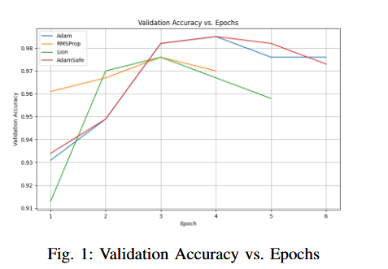
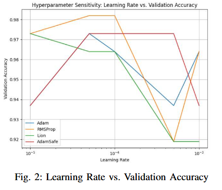

# AdamSafe Optimizer

**AdamSafe** is a novel optimization algorithm built on top of Adam, designed to improve stability and convergence in noisy learning environments such as medical image classification. It introduces a **Gradient Stability Factor (GSF)** to dynamically scale learning rates based on gradient consistency.

---

## Overview

Optimization algorithms lie at the core of training machine learning models. While Adam has been a go-to optimizer for many tasks, it often struggles with noisy gradients and unstable convergence in medical imaging and similar domains. AdamSafe extends Adam with:

- Gradient Stability Factor (GSF)
- Smoothed scaling based on gradient norm change
- Gradient clipping
- Lightweight design (one scalar per parameter)

AdamSafe demonstrates superior stability and performance parity with Adam on standard image classification tasks.

---

## Key Features

- **Enhanced Stability:** Incorporates gradient stability factor to suppress erratic updates.
- **Efficient:** Lightweight design suitable for low-resource environments like Google Colab.
- **Compatible:** Easy integration with existing TensorFlow/PyTorch codebases.
- **Empirically Validated:** Tested on Cats vs Dogs, MNIST, CIFAR-10, Fashion-MNIST, and SVHN.

---

## Optimizers Reviewed

AdamSafe was developed after reviewing and evaluating a range of optimizers:

| Optimizer | Notes                                          |
| --------- | ---------------------------------------------- |
| BGD       | Stable but inefficient for large datasets      |
| SGD       | Fast but oscillatory due to noisy gradients    |
| Momentum  | Accelerates SGD with velocity                  |
| NAG       | Look-ahead gradient improves convergence       |
| AdaGrad   | Adaptive learning rates; risk of early decay   |
| RMSProp   | Suited for non-convex loss surfaces            |
| Adam      | Combines momentum + adaptive scaling           |
| Nadam     | Adam + NAG for better sparse gradient handling |
| AdaBelief | Stability via belief in gradient estimates     |
| Lion      | Memory-efficient, but hyperparameter sensitive |

---

## AdamSafe Algorithm

AdamSafe enhances Adam by:

- Tracking change in gradient norm:  
  $$ r*t = \frac{||\nabla_t||}{||\nabla*{t-1}||} $$
- Calculating stability factor:  
  $$ \text{gsf}\_t = \frac{1}{1 + |r_t - 1|} $$
  (clipped between 0.2 and 1.0)

- Smoothed GSF with momentum (β=0.9)
- Applied during update:  
  $$ \theta\_{t+1} = \theta_t - \eta \cdot \text{gsf}\_t \cdot \frac{\hat{m}\_t}{\sqrt{\hat{v}\_t + \epsilon}} $$

---

## Experimental Setup

- **Dataset:** [Kaggle Cats and Dogs](https://www.kaggle.com/c/dogs-vs-cats) (25,000 images)
- **Model:** ResNet-18 (pretrained), custom FC head with Dropout
- **Training:**
  - Image size: 224×224
  - Loss: Binary Crossentropy (BCEWithLogitsLoss)
  - Batch size: 32
  - Learning rate: tuned per optimizer
  - Scheduler: ReduceLROnPlateau
  - Early stopping with patience = 5
  - Epochs: Up to 30

---

## Results

### Accuracy Comparison

| Dataset       | Adam Accuracy  | AdamSafe Accuracy |
| ------------- | -------------- | ----------------- |
| Cats & Dogs   | 95.95% ± 0.34% | 95.71% ± 0.58%    |
| MNIST         | 98.50% ± 0.15% | 98.12% ± 0.21%    |
| CIFAR-10      | 91.80% ± 0.72% | 92.45% ± 0.67%    |
| Fashion-MNIST | 93.20% ± 0.48% | 93.80% ± 0.42%    |
| SVHN          | 96.10% ± 0.45% | 96.33% ± 0.39%    |

### On Cats & Dogs

| Optimizer    | Accuracy           | F1 Score           | Epoch Time (s) | Epochs |
| ------------ | ------------------ | ------------------ | -------------- | ------ |
| Adam         | 95.95% ± 0.34%     | 96.08% ± 0.30%     | 12.44          | 6      |
| RMSProp      | 93.57% ± 3.25%     | 94.01% ± 2.80%     | 9.70           | 4      |
| Lion         | 93.81% ± 0.89%     | 94.03% ± 0.65%     | 9.47           | 5      |
| **AdamSafe** | **95.71% ± 0.58%** | **95.86% ± 0.52%** | **9.71**       | **6**  |

 <!-- Replace with actual image -->
 <!-- Replace with actual image -->

---

## Strengths & Limitations

### ✅ Advantages

- Excellent stability in noisy gradient conditions
- High accuracy and low variance
- Lightweight and easy to implement
- Better generalization in some cases

### ⚠️ Limitations

- Requires tuning of `β_gsf` and learning rate
- Slightly underperforms Adam in extremely clean settings

---

## Future Work

- Dynamic tuning of β_gsf
- Evaluation on generative tasks (GANs, diffusion models)
- Integration with meta-learning or second-order optimization
- Applying to NLP and reinforcement learning models

---
